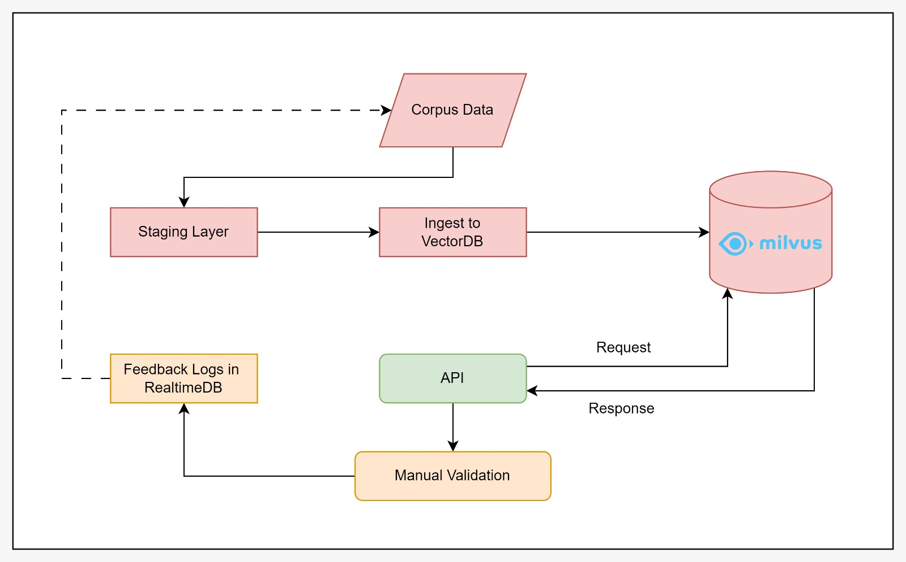

# TransEmber
Automatic Text Semantic Searching based on Small Corpus of each Category using all-MiniLM-L6-v2 and MilvusDB

# Schema Diagram

# Project Breakdown

- [x] `task 0:` Research Embedding Schema
- [x] `task 0:` Research MilvusDB
- [x] `task 0:` Create Semantic Search Boilerplate with Mini-LM Embedding
- [x] `task 0:` Create Mockup API
- [ ] `task 1:` Cleaning Internal Dataset
- [ ] `task 1:` Finetune Mini-LM with Internal Dataset
- [ ] `task 1:` Ingest Internal Dataset with Finetuned Embedding Models
- [ ] `task 2:` Storing Embedding with MilvusDB for Self-Hosted Schema / local deployment
- [ ] `task 2:` Optimize Searching Schema with API
- [ ] `task 3:` Planning Online Scenario ...

# Project Schedule

| Task             | Start Date | End Date   | Progress |
|------------------|------------|------------|----------|
| Task 0           | 2023-06-26 | 2023-06-30 | 100%     |
| Task 1           | 2023-07-03 | 2023-07-07 | 0%       |